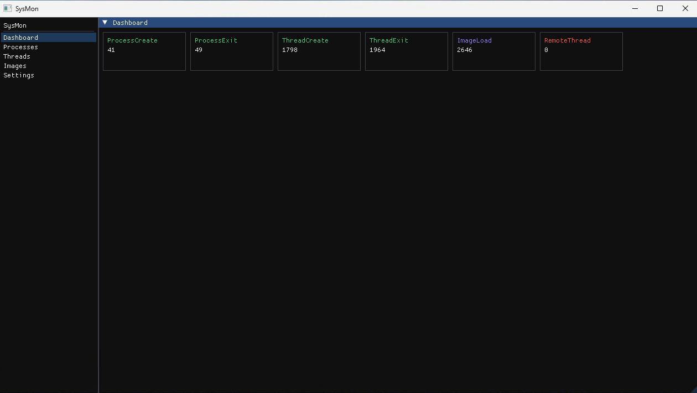
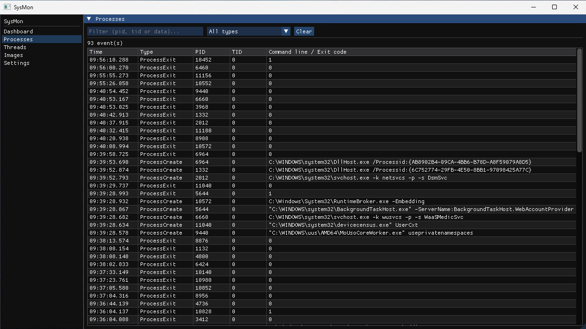
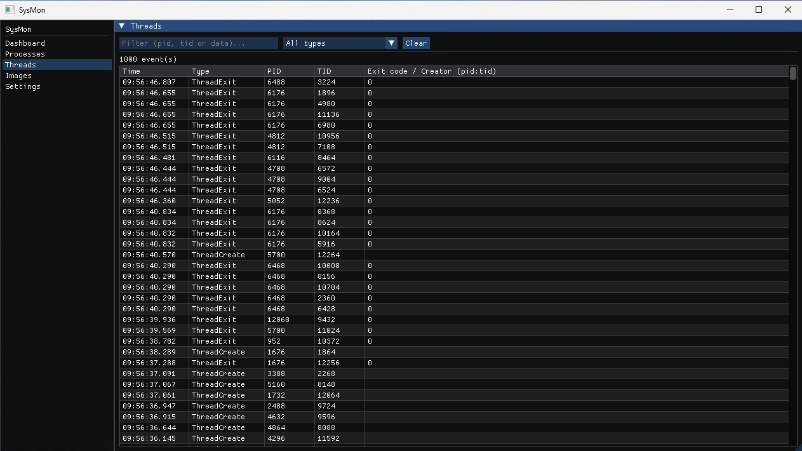
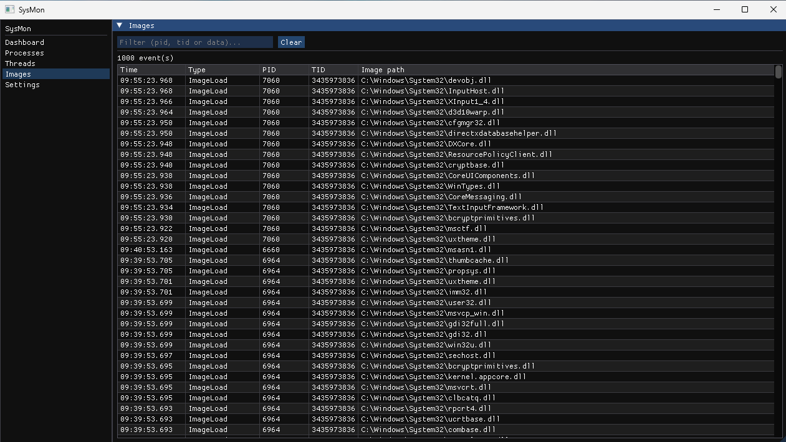
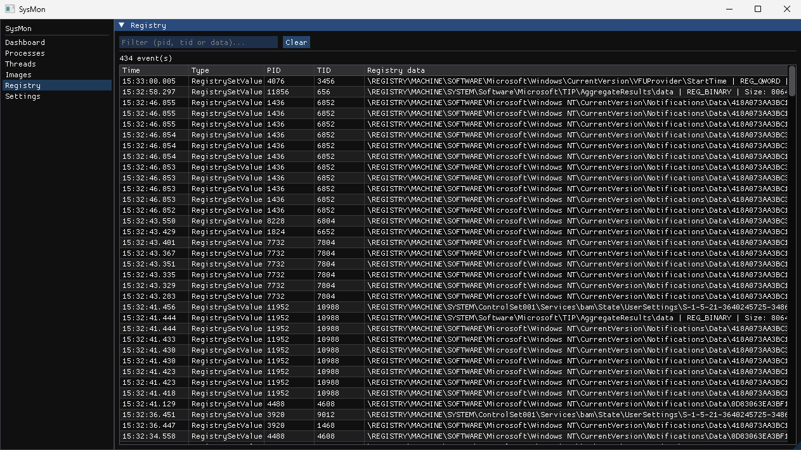
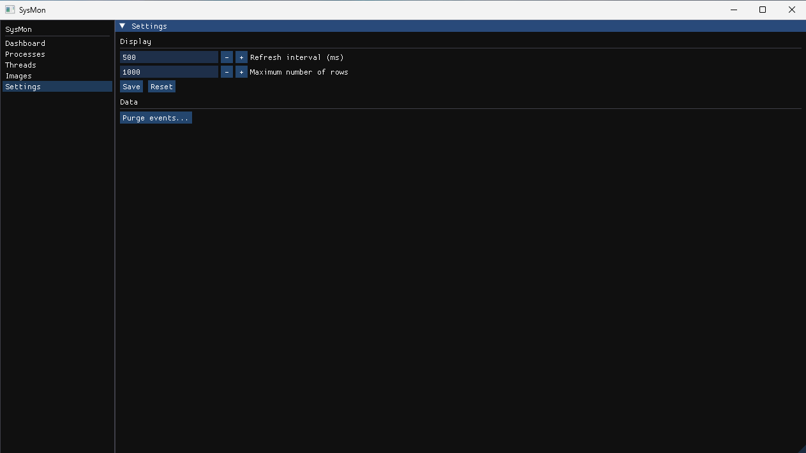

# SysMon

A Windows kernel driver (WDM/KMDF) that captures system events — process creation/exit, thread creation/exit, thread injection, image loads, and registry value writes — and streams them to a user-mode client application in real time. The client is a full ImGui/DirectX 11 desktop application with SQLite-backed persistence, structured logging, and a dedicated error-reporting pipeline.

## Architecture

```
┌──────────────────────────────────────────┐      ┌─────────────────────────┐
│               Kernel space               │      │       User space        │
│                                          │      │                         │
│  PsSetCreateProcessNotifyRoutineEx ──►  OnProcessNotify()                 │
│  PsSetCreateThreadNotifyRoutine    ──►  OnThreadNotify()                  │
│  PsSetLoadImageNotifyRoutine       ──►  OnImageNotify()                   │
│  CmRegisterCallbackEx              ──►  OnRegistryNotify()                │
│                      │                   │      │   SysMonClient.exe      │
│                      ▼                   │      │        │                │
│              FullItem<T> allocated       │      │  DriverConnector        │
│              pushed to g_State           │      │  EventProcessor         │
│              (FastMutex/ERESOURCE-       │      │  (poll thread)          │
│               protected)                 │      │        │                │
│                      │                   │ read │        ▼                │
│              Device: \\Device\sysmon ────┼──────┼──► EventRepository      │
│              SymLink: \\.\sysmon         │      │    (SQLite) ──► ImGui   │
└──────────────────────────────────────────┘      └─────────────────────────┘
```

Each event callback allocates a `FullItem<T>` from the paged pool, fills the typed `Data` field, and pushes it into a thread-safe linked list (`g_State`). `EventProcessor` polls the driver on a background thread, decodes each raw buffer back into typed events, and persists them through `EventRepository` into a local SQLite database. The GUI pages read from that repository and render the results with ImGui/DirectX 11.

---

## Events captured

| Event | Struct | Key fields |
|-------|--------|------------|
| Process created | `ProcessCreateInfo` | PID, parent PID, creating thread/process, command line |
| Process exited | `ProcessExitInfo` | PID, exit code |
| Thread created | `ThreadCreateInfo` | thread ID, owning process ID |
| Thread exited | `ThreadExitInfo` | thread ID, owning process ID, exit code |
| Image loaded | `ImageLoadInfo` | PID, image size, load address, image file path |
| Remote thread created | `RemoteThread` | creator PID/TID, target PID/TID — flags cross-process thread creation (code injection) |
| Registry value written | `RegistrySetValueInfo` | PID/TID, key path, value name, `REG_*` type, data size, first 256 bytes of the written data |

All structs inherit `ItemHeader` which carries the event type tag, size, and a `LARGE_INTEGER` timestamp.

### Internal event layout

```cpp
// Kernel-internal wrapper — LIST_ENTRY + typed data, one allocation
template<typename T>
struct FullItem {
    LIST_ENTRY Entry;   // intrusive list node
    T Data;             // ProcessCreateInfo / ThreadExitInfo / …
};

// Queue operations use the common base for size-agnostic reads
auto info = CONTAINING_RECORD(entry, FullItem<ItemHeader>, Entry);
auto size = info->Data.Size;
memcpy(buffer, &info->Data, size);
```

---

## GUI client

The client (`SysMonClient.exe`) is a windowed ImGui/DirectX 11 desktop application (no console) built around a small dependency-injection container and a layered architecture:

| Layer | Key types | Responsibility |
|-------|-----------|-----------------|
| **App** | `Application`, `DIContainer` | Wires every service together and drives the window/logic loops |
| **Core** | `DriverConnector`, `DriverService`, `EventProcessor` | Opens `\\.\sysmon`, installs/starts the driver, polls and decodes raw events on a background thread |
| **Storage** | `Database`, `EventRepository`, `ConfigRepository` | SQLite-backed persistence for captured events and user settings |
| **GUI** | `Win32Window`, `DX11Renderer`, `UIRenderer`, `Router`, `PageManager` | Window/swapchain setup, per-frame render loop, page navigation |
| **Pages** | `Dashboard`, `Processes`, `Threads`, `Images`, `Registry`, `EventTablePage`, `Settings` | One `IPage` implementation per screen, listed in the sidebar |
| **Components** | `Sidebar`, `StatCard`, `EventTable`, `FilterBar`, `AlertBanner` | Reusable `IComponent` building blocks shared across pages |
| **Logging** | `Logger` (spdlog) | Structured application logs, separate from kernel `DbgPrint` |
| **Reporter** | `ErrorDispatcher`, `ErrorQueue`, filters (`Severity`/`Category`/`RateLimit`), sinks (`Console`/`File`), `JsonFormatter`, `DumpProvider` | Centralized, thread-safe error pipeline: every `SysMonException` is queued, filtered, formatted as JSON and dispatched to sinks; crash dumps are written per fingerprint |
| **Exceptions** | `SysMonException`, `ConfigException`, `DeviceException`, `StorageException`, `ExceptionHandler` | Typed exception hierarchy thrown via `THROW_*` macros and caught at the top level |

User preferences (refresh interval, max visible rows, etc. — see `ConfigKeys.hpp`) are persisted through `ConfigRepository` and survive restarts.

---

## Project structure

```
SysMon/
├── .github/
│   ├── workflows/
│   │   └── build.yml          # CI — build, sign, release
│   └── RELEASE_NOTES.md       # Notes for the latest tagged release
├── assets/                    # README screenshots
├── cmake/
│   ├── FindWdk.cmake          # WDK auto-detection and target helper
│   └── SignDriver.cmake       # Post-build signing script (cmake -P)
├── include/                   # Kernel driver public headers
│   ├── Common.h               # Kernel includes, logging macros, pool helpers
│   ├── Device.h                # Device creation / notify callback declarations
│   ├── ExecutiveResource.h    # ERESOURCE RAII wrapper (shared/exclusive)
│   ├── FastMutex.h            # FAST_MUTEX RAII wrapper
│   ├── Globals.h              # Global driver state declaration
│   ├── Locker.h               # Generic scoped lock guard
│   ├── LookasideList.h        # Pool-efficient lookaside allocator wrapper
│   ├── Public.h               # Shared event structs (kernel + client)
│   └── Queue.h                # I/O queue declarations and IOCTL codes
├── src/                       # Kernel driver implementation
│   ├── Driver.cpp             # DriverEntry / DriverUnload (KMDF + WDM)
│   ├── Device.cpp             # Device creation + all notify callbacks
│   ├── Queue.cpp              # IRP dispatch — Read, Write, DeviceControl
│   ├── ExecutiveResource.cpp
│   ├── FastMutex.cpp
│   └── Globals.cpp            # Thread-safe event queue implementation
├── client/                    # User-mode GUI client (SysMonClient.exe)
│   ├── include/
│   │   ├── app/               # Application root (DIContainer wiring, run loop)
│   │   ├── core/              # DriverConnector, DriverService, EventProcessor
│   │   ├── exceptions/        # SysMonException hierarchy + ExceptionHandler
│   │   ├── gui/                # Router, PageManager, DX11Renderer, Win32Window
│   │   │   ├── components/    # Reusable IComponent widgets (Sidebar, EventTable...)
│   │   │   └── pages/         # IPage screens (Dashboard, Processes, Threads...)
│   │   ├── interfaces/        # Abstract contracts (IPage, ILogger, IDatabase...)
│   │   ├── logging/           # spdlog-backed Logger
│   │   ├── macros/            # THROW_*/logging helper macros
│   │   ├── reporter/          # Error pipeline: queue, dispatcher, filters, sinks
│   │   └── storage/           # SQLite Database, EventRepository, ConfigRepository
│   └── src/                   # Mirrors include/ — one .cpp per header
│       └── Client.cpp         # wWinMain — application entry point
├── vendor/                    # Git submodules: imgui, spdlog, nlohmann-json (+ vendored sqlite3)
├── inf/
│   └── SysMon.inf.in          # INF template (expanded by CMake)
├── scripts/
│   └── Export-SigningCert.ps1 # One-shot helper: export cert for CI secrets
├── CMakeLists.txt
├── CMakePresets.json
└── .gitignore
```

---

## Requirements

| Tool | Minimum version |
|------|----------------|
| Windows 10/11 (dev machine) | 22H2+ |
| Visual Studio | 2022 (17.x) with *Desktop development with C++* workload |
| CMake | 3.20+ |
| Windows Driver Kit (WDK) | 10.0.22621.0+ — [Download](https://learn.microsoft.com/windows-hardware/drivers/download-the-wdk) |
| DirectX 11 capable GPU | Required to run the client (ImGui renders through `d3d11`/`dxgi`) |

> The WDK version must match the Windows SDK version installed alongside Visual Studio.

The client vendors ImGui, spdlog and nlohmann-json as git submodules; fetch them before configuring:

```bat
git submodule update --init --recursive
```

---

## Build

### Quick start (CMake Presets)

```bat
REM KMDF Debug
cmake --preset debug
cmake --build --preset debug

REM KMDF Release
cmake --preset release
cmake --build --preset release

REM WDM Debug
cmake --preset wdm-debug
cmake --build --preset wdm-debug

REM WDM Release
cmake --preset wdm-release
cmake --build --preset wdm-release
```

Each preset produces:
- `build/<preset>/<Config>/SysMon.sys` — the kernel driver
- `build/<preset>/SysMonClient.exe` — the user-mode client
- `build/<preset>/SysMon.inf` — the driver INF

### Manual configure (non-standard WDK path)

```bat
cmake -G "Visual Studio 17 2022" -A x64 ^
      -DWDK_ROOT="D:/WDK/10" ^
      -DWDK_VERSION="10.0.26100.0" ^
      -B build/custom
cmake --build build/custom --config Debug
```

### Available CMake options

| Option | Default | Description |
|--------|---------|-------------|
| `USE_KMDF` | `ON` | Use KMDF (recommended) |
| `USE_WDM` | `OFF` | Use low-level WDM |
| `BUILD_CLIENT` | `ON` | Build the user-mode client |
| `DRIVER_SIGN` | `OFF` | Sign the `.sys` after build |
| `WDK_ROOT` | Auto | WDK root path |
| `WDK_VERSION` | Auto | WDK version string (`10.0.XXXXX.0`) |
| `KMDF_VERSION` | Auto | KMDF version string (`1.XX`) |

---

## Driver signing

Signing is required for the driver to load on a target machine in test mode. A self-signed certificate is sufficient for development and testing.

### 1. Create the self-signed certificate (once per machine)

```bat
cmake --build build/debug --target create_test_cert
```

This creates `CN=SysMon` in `Cert:\CurrentUser\My` using `New-SelfSignedCertificate` (valid 10 years).

### 2. Build with signing enabled

```bat
cmake --preset release -DDRIVER_SIGN=ON
cmake --build --preset release
```

The `release-signed` preset has `DRIVER_SIGN=ON` pre-configured:

```bat
cmake --preset release-signed
cmake --build --preset release-signed
```

Signing is done via `cmake/SignDriver.cmake` which calls `signtool.exe` using the `CN=SysMon` certificate from `Cert:\CurrentUser\My`.

---

## Deployment on a test machine

### 1. Enable Test Signing Mode

On the target machine (as Administrator), then reboot:

```bat
bcdedit /set testsigning on
```

> Never enable test signing on a production machine.

### 2. Install the certificate

Copy the `.cer` file to the target machine, then run as Administrator:

```bat
certutil -addstore Root SysMon.cer
certutil -addstore TrustedPublisher SysMon.cer
```

### 3. Install the driver

```bat
sc create SysMon type= kernel binPath= C:\path\to\SysMon.sys
sc start SysMon
```

Or via the CMake target (requires `devcon` in the WDK tools):

```bat
cmake --build build/release --target install_driver
```

### 4. Run the client

```bat
build\release\SysMonClient.exe
```

`SysMonClient.exe` requires administrator privileges (declared in its manifest) since it starts the driver service and opens `\\.\sysmon`. On launch it:

- starts the `SysMon` service through `DriverService` (no-op if already running),
- spawns the `EventProcessor` background thread that polls the driver and persists decoded events to a local SQLite database,
- opens the ImGui/DirectX 11 window with the **Dashboard**, **Processes**, **Threads**, **Images**, **Registry** and **Settings** pages (see [Screenshots](#screenshots)).

### 5. Uninstall

```bat
sc stop SysMon
sc delete SysMon
REM or
cmake --build build/release --target uninstall_driver
```

---

## CI/CD

The GitHub Actions pipeline (`.github/workflows/build.yml`) builds all four configurations (KMDF debug/release + WDM debug/release) on every push and pull request.

### What the pipeline does

| Step | Detail |
|------|--------|
| Install WDK | Silent install, cached between runs |
| Import certificate | From `DRIVER_CERT_PFX_B64` secret — skipped on PRs from forks |
| Configure | `DRIVER_SIGN=ON` for release builds when cert is present, `OFF` otherwise |
| Build | All four CMake presets |
| Export `.cer` | Public certificate included in the release package |
| Upload artifacts | One `.zip` per configuration, retained 30 days |
| GitHub Release | Created automatically on `v*` tags, includes all zips + install instructions |

### Setting up signing secrets (one-time)

**1.** Create the certificate locally (if not done):
```bat
cmake --build build/debug --target create_test_cert
```

**2.** Export it for GitHub Secrets:
```powershell
.\scripts\Export-SigningCert.ps1
```

This prints the base64-encoded PFX directly to the console (nothing is written to disk).

**3.** Add the two secrets in **GitHub > Settings > Secrets and variables > Actions**:

| Secret name | Value |
|-------------|-------|
| `DRIVER_CERT_PFX_B64` | Base64 string printed by the script |
| `CERT_PASSWORD` | Password entered during export (can be empty) |

**4.** Trigger a release by pushing a version tag:
```bash
git tag v1.0.0
git push origin v1.0.0
```

---

## Debugging

### WinDbg kernel debugging

On the target machine (as Administrator):

```bat
bcdedit /debug on
bcdedit /dbgsettings net hostip:<DEV_MACHINE_IP> port:50000 key:1.2.3.4
REM Reboot
```

In WinDbg on the dev machine:

```
File > Attach to Kernel > Net
Port: 50000  |  Key: 1.2.3.4
```

Enable all DbgPrint output:

```
ed nt!Kd_DEFAULT_MASK 0xFFFFFFFF
```

### Debug messages (DbgPrint)

`LOG_INFO`, `LOG_WARN`, `LOG_ERROR`, `LOG_TRACE` in `Common.h` emit messages visible in:
- **DebugView** (Sysinternals) — without a debugger attached (`Capture > Capture Kernel`)
- **WinDbg** — with a kernel debugger attached

Messages are compiled out in Release builds (`#if DBG`).

### Client-side logging and crash reports

The GUI client logs independently of the driver through `Logger` (spdlog, console + rotating file sink). `Error`/`Fatal` log entries are additionally routed through the **reporter** pipeline (`ErrorDispatcher` → filters → `JsonFormatter` → `ConsoleSink`/`FileSink`), and `DumpProvider` writes a `.dmp` crash dump named after the error's fingerprint whenever an unhandled `SysMonException` reaches the top-level `ExceptionHandler`.

---

## Screenshots

### Dashboard



### Processes



### Threads



### Images



### Registry



### Settings



---

## Registry monitoring

The driver registers a registry callback through `CmRegisterCallbackEx` (altitude `7657.124`) at device creation, and unregisters it on unload. The callback (`OnRegistryNotify` in `src/Device.cpp`) reacts to the **post** notification of value writes:

- Only `RegNtPostSetValueKey` operations that **succeeded** are considered — failed writes are ignored.
- The full key path is resolved with `CmCallbackGetKeyObjectIDEx`; only writes under **`\REGISTRY\MACHINE`** (HKLM) are captured to keep the volume manageable.
- Each event is packed into a variable-length `RegistrySetValueInfo` (see `include/Public.h`): the fixed part carries the PID/TID, the `REG_*` data type and the real data size, followed inline by the null-terminated key name, the null-terminated value name and the raw data itself. The copied data is **capped at 256 bytes** (`ProvidedDataSize`), the actual size remains available through `DataSize`.

On the client side, `EventProcessor::RegistryValue()` decodes the payload according to its type before persisting it to SQLite:

| `REG_*` type | Rendered as |
|--------------|-------------|
| `REG_SZ`, `REG_EXPAND_SZ`, `REG_LINK` | UTF-8 string |
| `REG_MULTI_SZ` | Strings joined with `;` |
| `REG_DWORD`, `REG_DWORD_BIG_ENDIAN` | `0x%08X (decimal)` — big-endian values are byte-swapped |
| `REG_QWORD` | `0x%016llX (decimal)` |
| `REG_NONE` | `(none)` |
| `REG_BINARY`, `REG_RESOURCE_*`, unknown | Space-separated hex dump |

The stored `data` column has the form `HKLM\...\Key\ValueName | REG_SZ | Size: 24 | Data: ...` and is displayed in the **Registry** page of the client, with the usual filter bar and auto-refresh.

---

## Resources

- [WDK Documentation](https://learn.microsoft.com/windows-hardware/drivers/)
- [Windows driver samples](https://github.com/microsoft/Windows-driver-samples)
- [WDF API reference](https://learn.microsoft.com/windows-hardware/drivers/ddi/_wdf/)
- [PsSetCreateProcessNotifyRoutineEx](https://learn.microsoft.com/windows-hardware/drivers/ddi/ntddk/nf-ntddk-pssetcreateprocessnotifyroutineex)
- [PsSetCreateThreadNotifyRoutine](https://learn.microsoft.com/windows-hardware/drivers/ddi/ntddk/nf-ntddk-pssetcreatethreadnotifyroutine)
- [PsSetLoadImageNotifyRoutine](https://learn.microsoft.com/windows-hardware/drivers/ddi/ntddk/nf-ntddk-pssetloadimagenotifyroutine)
- [CmRegisterCallbackEx](https://learn.microsoft.com/windows-hardware/drivers/ddi/wdm/nf-wdm-cmregistercallbackex)
- [Filtering Registry Calls](https://learn.microsoft.com/windows-hardware/drivers/kernel/filtering-registry-calls)
- [Driver Verifier](https://learn.microsoft.com/windows-hardware/drivers/devtest/driver-verifier)
- [Static Driver Verifier](https://learn.microsoft.com/windows-hardware/drivers/devtest/static-driver-verifier)
